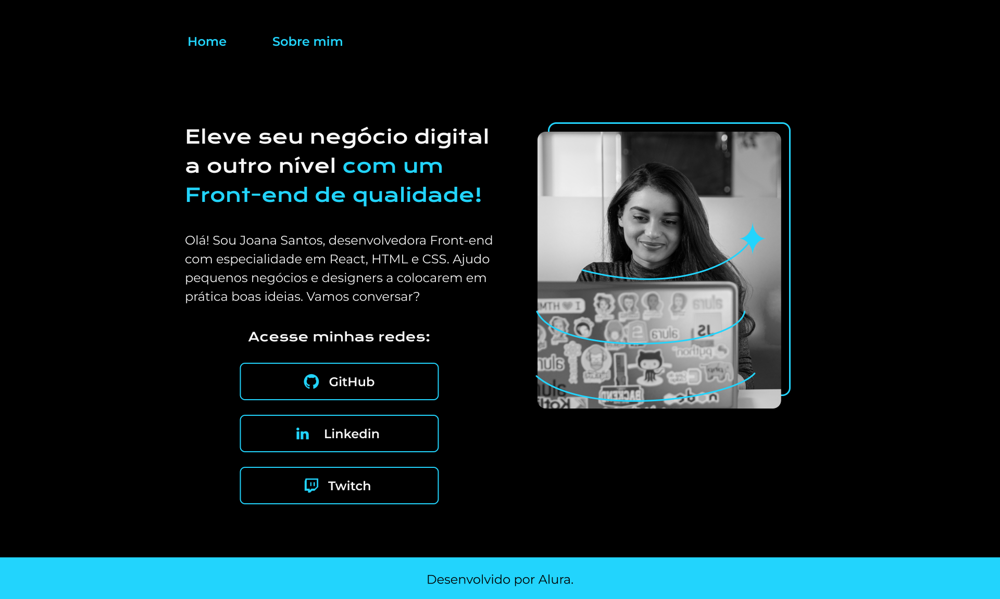

# Portfólio

Projeto durante a trila de inicante em programação G8 - ONE

## Ferramentas utilizadas:
- HTML
- CSS3
- Flex-box

Você pode acessar o projeto pelo [link](https://davidwilliamx.github.io/portifolio_imersao_alura/).
